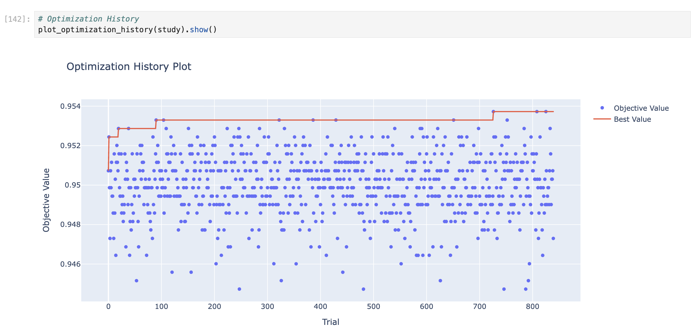
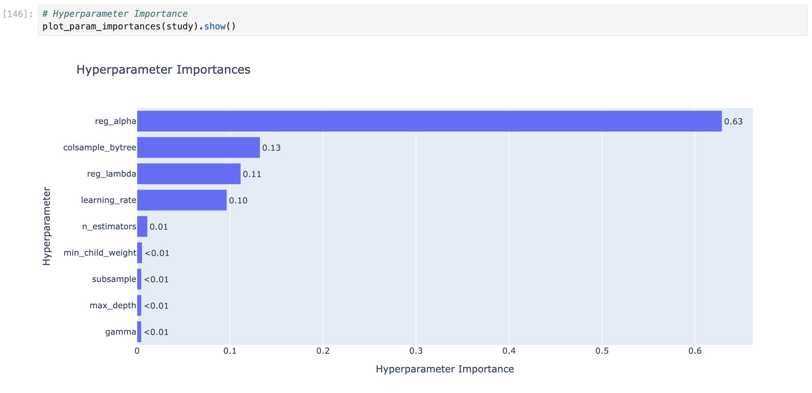

# Contract Lapse Prediction

This project explores the relationship between **government contract awards** and the likelihood of contracts lapsing.  
The analysis combines **USAspending contract data** with **Compustat firm-level financials**, applies feature engineering, and develops predictive machine learning models.

---

## Project Structure

The project is organized into four main scripts (notebooks/PDFs), each building on the previous step:

### **1. 01_data_preprocessing**
- Collect and clean data from **Compustat (financials)** and **USAspending (contracts)**.  
- Standardize formats and merge into a unified dataset for modeling.

### **2. 02_feature_engineering**
- Perform feature engineering and preprocessing on structured variables (e.g., product or service code).  
- Leave out `transaction_description` for now.  
- Train baseline models (Logistic Regression, Random Forest, XGBoost) to establish performance benchmarks.

### **3. 03_feature_engineering_text**
- Process the `transaction_description` field using **LLM-based classification** into themes.  
- Integrate these text-derived features with structured data.  
- Re-test models and compare performance improvements.

### **4. 04_model_development**
- Select **XGBoost** as the primary model (based on evaluation of baseline models).  
- Perform **hyperparameter optimization** using:
  - Random Search  
  - Bayesian Optimization (TPE)  
  - Grid Search  
- Compare results using cross-validation metrics (Accuracy, ROC-AUC, PR-AUC).  

To support visualization:  
- This step is provided both as a **PDF** (`04_model_development.pdf`) and an **HTML** version (`04_model_development.html`).

---

## Model Performance

The tuned **XGBoost** model achieved:

- **Accuracy:** 84%  
- **ROC-AUC:** 0.892  
- **PR-AUC:** 0.887  

### Example Visualizations

Optimization history and feature importance are shown below:

  
*Optuna optimization history across trials*

  
*Relative importance of tuned hyperparameters*

---

## Purpose

The broader goal of this project is to study how **government awards influence firm performance and potential labor market outcomes.**  
This is **Part 1: Contract Lapse Prediction** in a larger multi-part research project.

---

## Files Included
- `01_data_preprocessing.ipynb / .pdf`  
- `02_feature_engineering.ipynb / .pdf`  
- `03_feature_engineering_text.ipynb / .pdf`  
- `04_model_development.ipynb / .pdf / .html`

---

## Next Steps
Future parts of this repository will extend the analysis to:
- **Firm performance outcomes** (Compustat linkages)  
- **Labor market impacts** (BLS/industry-level data) 